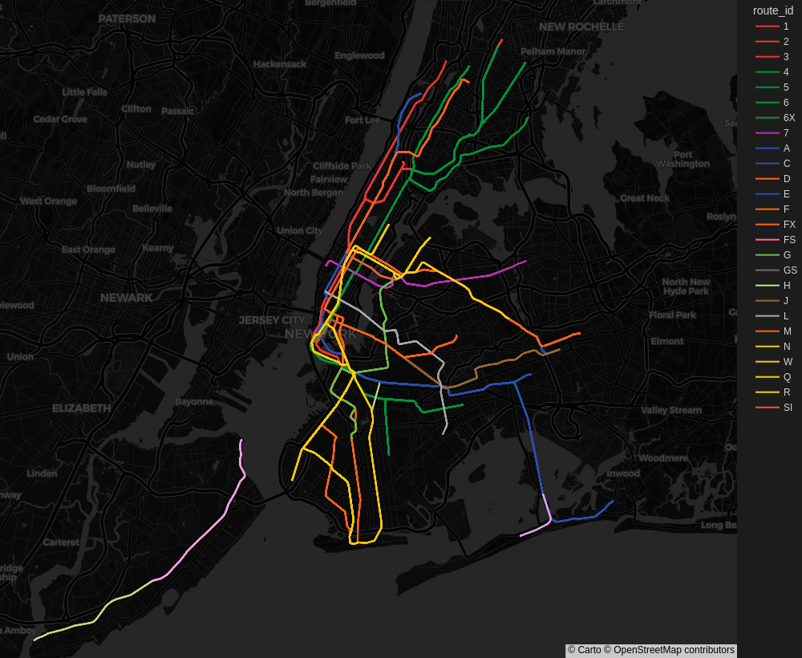
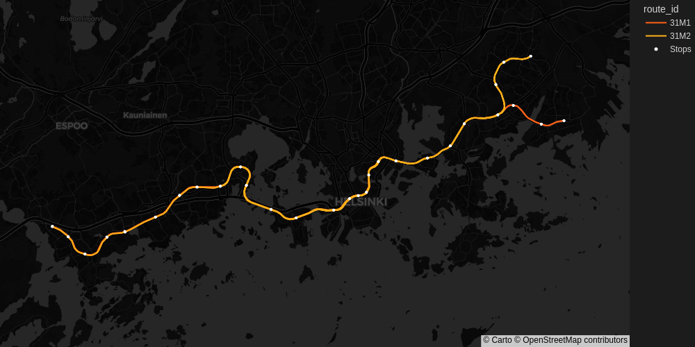
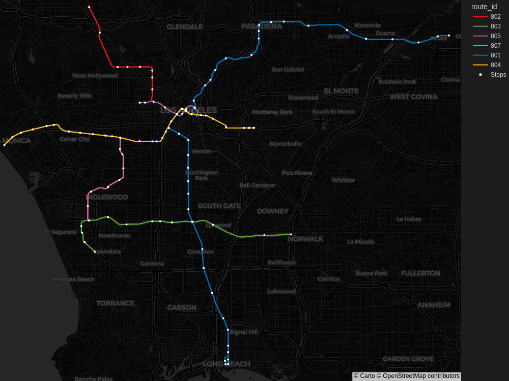
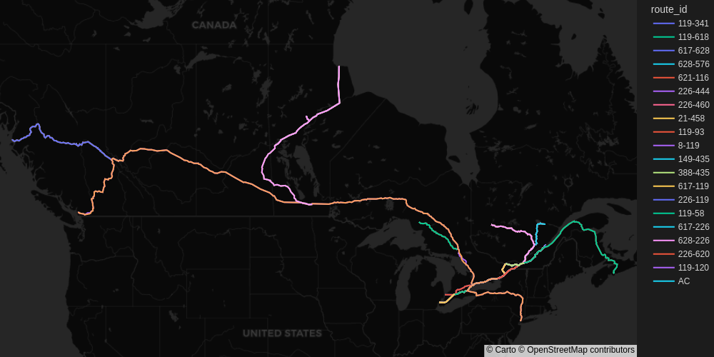
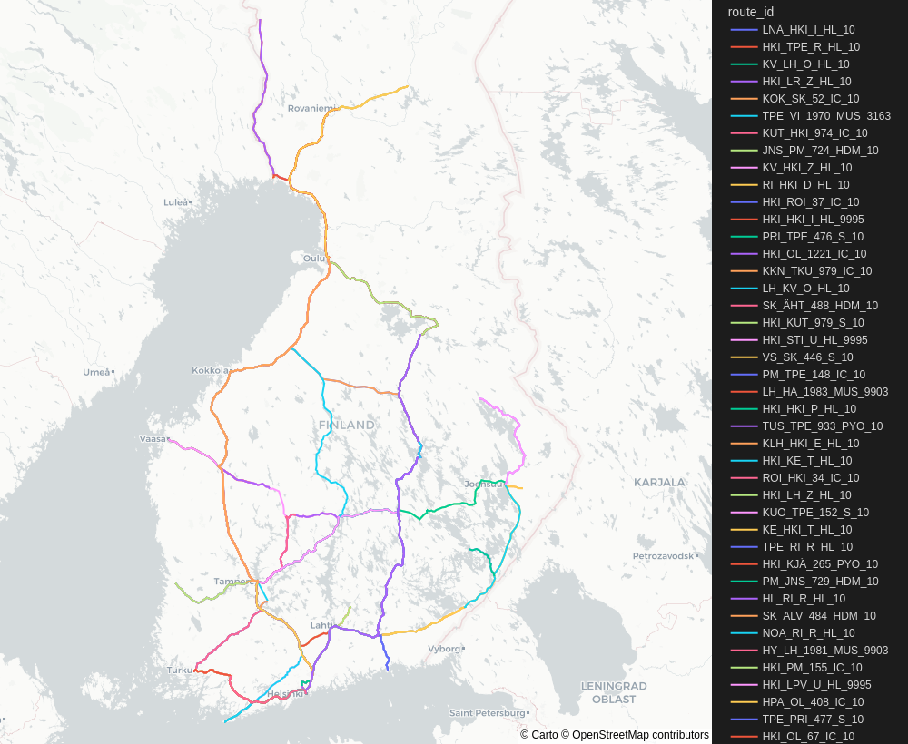

# gtfs-plotter


A tool for reading public transit routes from [GTFS](https://gtfs.org/) files and plotting them on a map

## Usage

First, install the required dependencies
```sh
pip3 install -r requirements.txt
# OR
make dep
```
After this you can run
```
python3 plot.py --help
```
to see the available commands.

## Development

Linting and running tests:
```sh
make lint && make typecheck && make test
```

## Examples

### New York City Subway
Assuming the GTFS data has been exported to `./data/mta_subway`:
```sh
python3 plot.py data/mta_subway --map-style carto-darkmatter --heigth 820 --width 1000 --zoom 10
```


### Helsinki Metro:
```sh
python3 plot.py data/hsl --map-style carto-darkmatter --filter-routes 31M2 31M1 --width 1000 --heigth 500 --zoom 10 --stops
```


### Los Angeles Metro Rail:
```sh
python3 plot.py data/la_metro_rail --map-style carto-darkmatter --heigth 820 --width 1000 --zoom 10 --stops
```


### Via Rail Canada:
```sh
python3 plot.py data/viarail --map-style carto-darkmatter --heigth 500 --width 1000 --zoom 3 --stops
```


### VR Group Passenger routes:
```sh
python3 plot.py data/vr_passenger --map-style carto-darkmatter --heigth 900 --width 1000 --zoom 5 --stops
```
