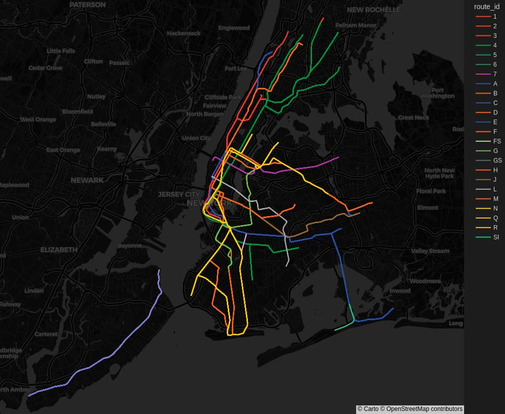
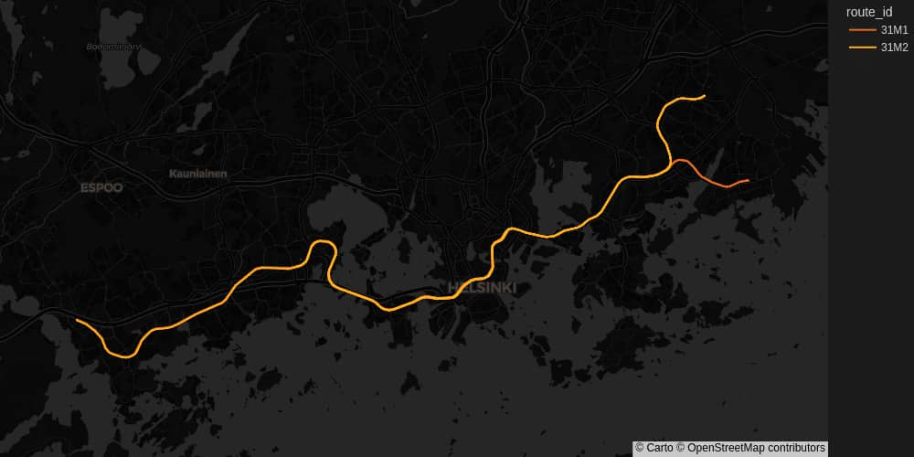
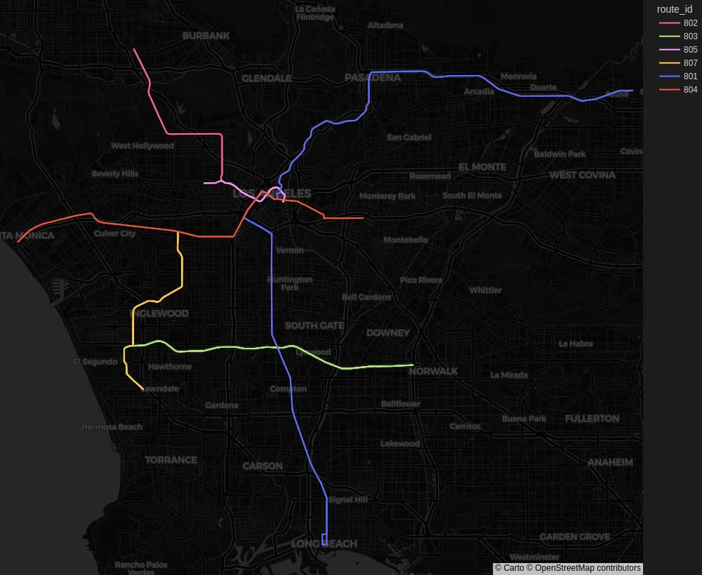

# gtfs-plotter


A tool for reading public transit routes from [GTFS](https://gtfs.org/) files and plotting them on a map

## Usage

First, install the required dependencies
```sh
pip3 install -r requirements.txt
# OR
make dep
```
After this you can run
```
python3 plot.py --help
```
to see the available commands.

## Development

Linting and running tests:
```sh
make lint && make typecheck && make test
```

## Examples

### New York City Subway

Assuming the GTFS data has been exported to `./mta_subway`:
```sh
python3 plot.py -s mta_subway/shapes.txt -r mta_subway/routes.txt --shape-id-regex '^[^.]+' --map-style carto-darkmatter --heigth 820 --width 1000 --zoom 10
```


### Helsinki Metro:

```sh
python3 plot.py -s hsl/shapes.txt -r hsl/routes.txt --shape-id-regex '^[^_ ]+' --map-style carto-darkmatter --filter-routes 31M2 31M1 --width 1000 --heigth 500 --zoom 10
```


### Los Angeles Metro Rail:

```sh
python3 plot.py -s la_metro_rail/shapes.txt -r la_metro_rail/routes.txt --shape-id-regex '^[^a-zA-Z]+' --map-style carto-darkmatter --heigth 820 --width 1000 --zoom 10
```
